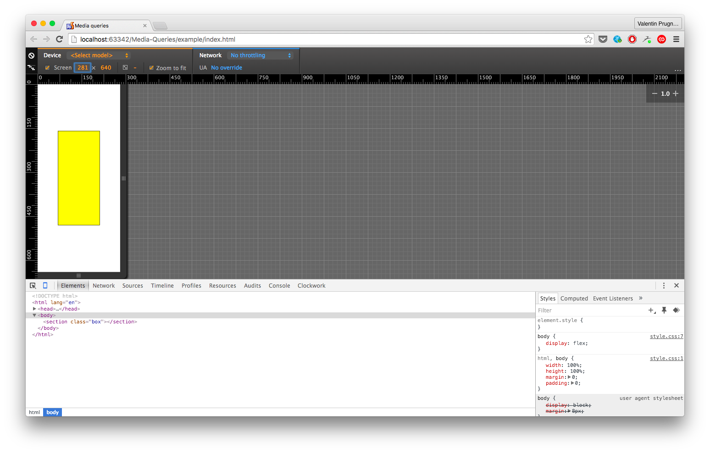

# Media-Queries

Media Queries exercise.

## Exercise

Create a page with a box. The colour of the box should change according to the size of the viewport:

- Less or equal to 320px: yellow
- Less or equal to 500px: green
- Less or equal to 1000px: red
- More than 1000px: blue

## Example

You can open the example in your browser, but do not take a look at the code! :)

## Tip

To test your solution, open the Chrome Dev Tools, click on the small smartphone icon at the top left corner of the dev tools window 
and play around with the width of the viewport (see screenshot )